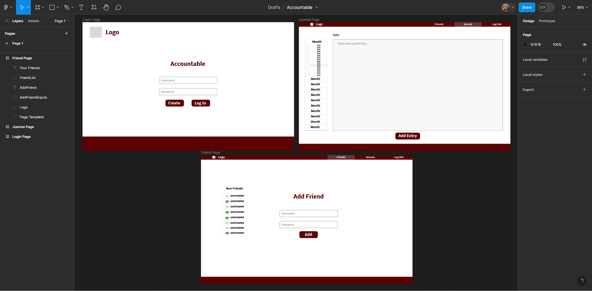

# Accountable: Startup
A full-stack journaling web application that allows people to quickly journal in a social way.
## Elevator Pitch
Every year, hundreds of people begin the new year with a resolution to more consistently journal. Journaling can help to improve gratitude, positivity, self-awareness, and memory. However, it is so hard to stay consistent with this valuable habit. Accountable is a full stack web application that turns daily journaling into a social event, making it easier and more fun to adopt this critical daily practice. Users can follow one another, and can see whether or not their friends have journaled that day. All journal entries are easily accessible, allowing users to quickly look back at their previous entries.
## Design

## Key Features
- Secure login with HTTPS
- Ability to pick a day and view, add, or edit journal entries for that day
- Ability to follow and unfollow other users
- Writing status of other users displayed in real time
- Journal entries are persistently stored
## Technologies
I am going to use the required technologies in the following ways.
- **HTML:** Three HTML pages. One page to log in, one page to view friends requests, and one page to view and add journal entries.
- **CSS:** Styling the pages in a way that is consistent and simple across all three pages and various different devices.
- **JavaScript:** Allows login, navigating between pages, applying friending and unfriending, and saving journal entries.
- **Service:** Login, retrieving journal entries, allows for friend requests
- **Database:** Stores user login information, friend network, and journal entries. Credentials stored here as well. Secures the application.
- **WebSocket:** As friends write journal entries, their statuses will update in real time
- **React:** The application will be refactored to use React elements

## HTML Deliverable
In this deliverable, I coded markup for my site in HTML.
- **HTML pages:** I coded up 3 HTML pages. One is the landing page, where users will log in or create a profile. The second is the journaling page, where users will create and edit journal entries. The third is the friends page, where users can view which friends have journaled and add new friends.
- **Links:** The landing page redirects the user to the journaling page when the user clicks the "Log in" button. The journaling and friend pages both have nav bars with links to each of the other pages (with the link to the landing page being the "Log out" button).
- **Text:** The quote on the journaling page is the placeholder for the third party service I will be using, which is an inspirational quote API.
- **Image:** I included a logo image that will be in the header on each of my pages.
- **DB/Login:** I included an input box for username and password, and buttons for either creating an account or logging in. The authenication of users will happen through the database. The months and days on the journaling page will have a journaling entry associated with them that can be pulled from the database. If the current date is chosen - as it is in my html placeholders - there will be a text area where the user can write their journal entry. The friends list included on the friends page also represents data that will be pulled out of the database.
- **WebSocket:** The checkboxes represent the realtime reporting of whether a user has written or not.

## CSS Deliverable
In this deliverable, I styled each page on my site in CSS.
- **Sections:** I created 3 stylesheets, one for each page of my site. Each stylesheet has a header, body, and footer section.
- **Nav Bar:** I styled the navigation elements to appear as buttons and other properly stlyled elements. These navigation elements include the login button, the friends section of the nav bar, the journal section of the nav bar, and the logout section of the nav bar.
- **Resizing:** Each page is reponsive to resizing, and elements in the body will move and shrink as necessary to fit the screen.
- **Application Elements:** The page has consistent styling and colors, and a good use of white space.
- **Application Text:** The font sizes and styles are consistent across the site and intuitively hint to their use.
- **Logo Image:** There is a logo image on the left end of each nav bar that is properly styled and sized.